## バックエンドのレポジトリはこちら

https://github.com/tomo324/idea-app-backend

## このサービスについて

アイデアを投稿して共有するサービスです。AI融合機能によって、投稿された複数のアイデアを融合して新しいアイデアを生み出すことができます。

## 作った理由

「多くの人に価値を届けるサービスを作りたい。しかし、どのようなサービスがより多くの人々のニーズに答えられるのか分からない。」このような状況で試行錯誤した個人的な経験から、アイデアを発見するこのサービスを開発しました。

現在、新規事業やアプリ開発のアイデアは様々な場所に散乱しています。人々が生活の中で感じた「こんなものがあったらいいのに」という声は、様々なプラットフォームの大量のコンテンツの中に埋もれてしまっています。このサービスの目的は、人々が生活の中で得た「気づき」が埋もれてしまうことなく、有効活用されるような場所を提供することにあります。一人でも多くのユーザーに「ここに気づきを書けば誰かが解決してくれそうだ」と思ってもらい、多くのアイデアが集まる場になることを目指しています。

世の中に浸透し私たちの生活の一部になっているサービスも、最初は些細な気づきから生まれました。「ここが不便だ」「こんなサービスがあったらいいのに」という日常の些細な気づきは、多くの可能性をはらんでいます。

アイデアは人々の経験から生まれます。生成AIを利用しても、画期的なアイデアをゼロから生み出すことは難しいです。このサービスでは、人々の経験に基づいたアイデアを元にAI融合を行うことで、画期的なアイデアを生み出すことが可能になっています。

多様なアイデアの蓄積と、AIによる融合の組み合わせによって、このサービスが生み出せる価値は無限大に広がっていくと考えています。

## 技術構成
フロントエンド: TypeScript(ver 5.3.3) / React(ver 18.2.0) / Next.js(App router) (ver 14.1.0)

バックエンド: TypeScript(ver 5.3.3) / NestJS(ver 10.2.1)

ORM: Prisma(ver 5.7.1)

CSSフレームワーク: Tailwind CSS

DB: PostgreSQL

開発ツール: Docker / Storybook

テスト: Jest / pactumjs / React Testing Library

デプロイ: Vercel(フロント) / Heroku(バックエンド)

外部サービス: DeepL API / ChatGPT API

デザイン: Figma

## 工夫したポイント

### サービスの面白さがユーザー数に依存し過ぎないようにした
SNSのようなサービスを個人開発する際、ネックとなるのがユーザー数の確保です。多くのユーザーがいないと機能を十分に利用できないサービスの場合、ユーザー数が少ないリリースの初期段階では使える機能が制限され、「つまらない」と感じてしまいます。
 
このサービスではAI融合機能にランダム性を持たせ、ユーザー数や投稿数が少なくても様々な融合パターンを楽しめるようにしました。もちろん、ユーザー数が多ければ多いほど多様なアイデアを扱うことができるようになり、サービスはより面白くなります！

### UI, UXへのこだわり
快適に操作できるかがユーザーの定着率を左右すると考え、UI, UXには特にこだわりました。一部、人気サービスのUIを参考にすることにより、多くの人が直感的に操作できるようにしました。
 
また、Next.jsのIntercepting Routesを取り入れることにより高い操作感でモーダル等を扱えるようにしました。

### テストを開発に積極的に取り入れた
機能の拡張やリファクタリングの際にコードの品質を維持しやすくするため、開発の中でE2Eテストやユニットテストを積極的に取り入れました。また、テスト駆動開発のサイクルを回しながら開発を行うことで、効率よく実装できるようになりました。

## ER図

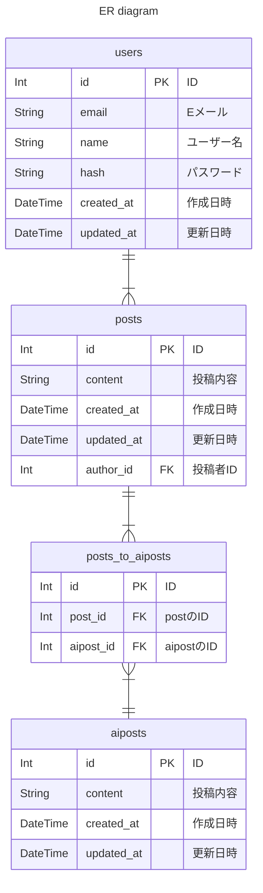

## シーケンス図

### auth

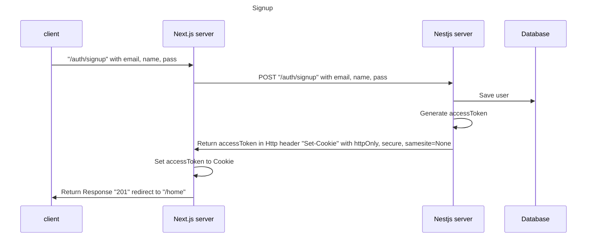

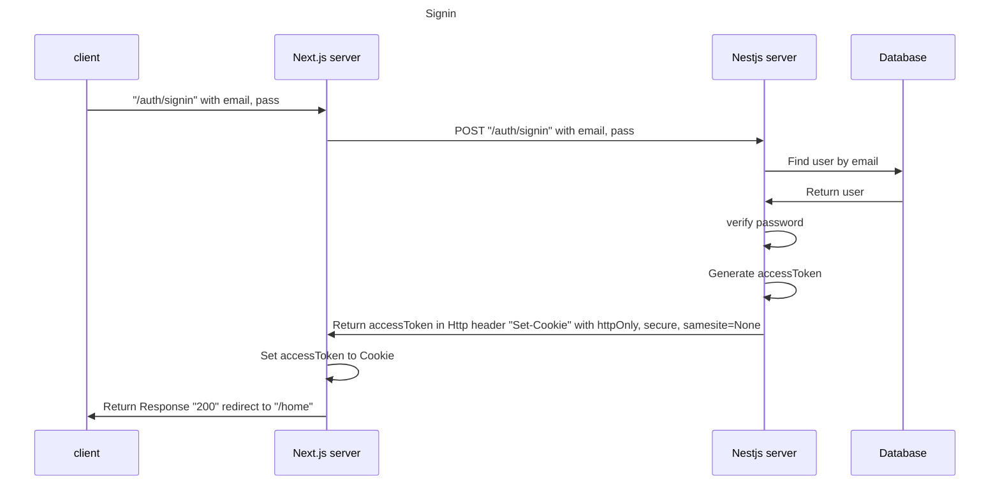

### home

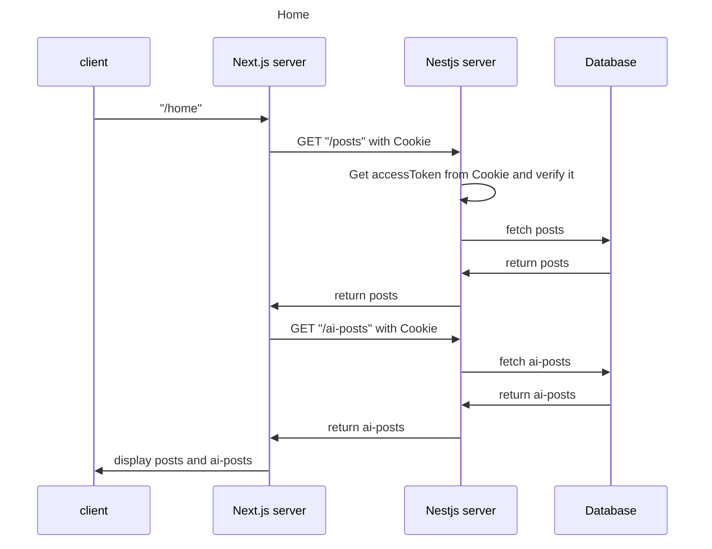

### posts

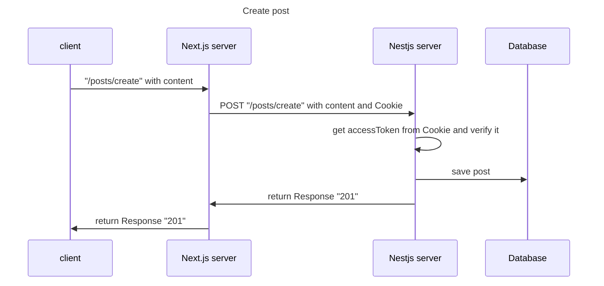

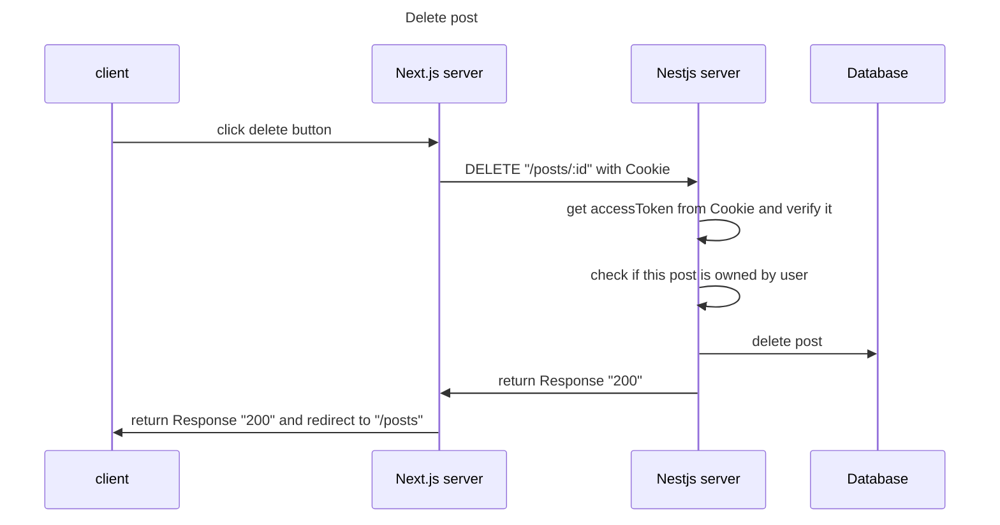

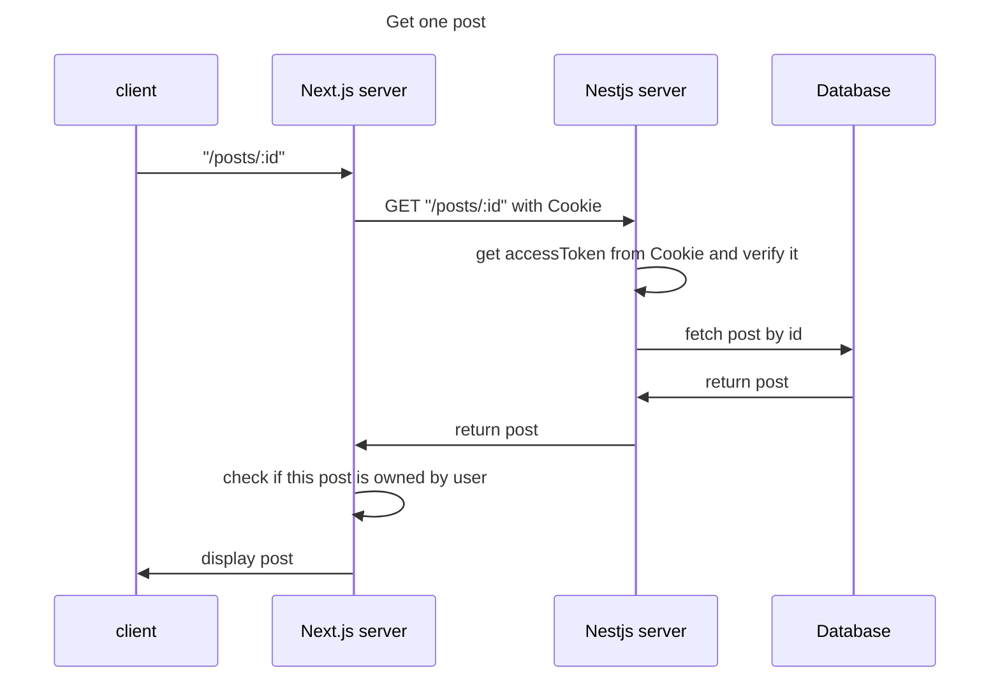

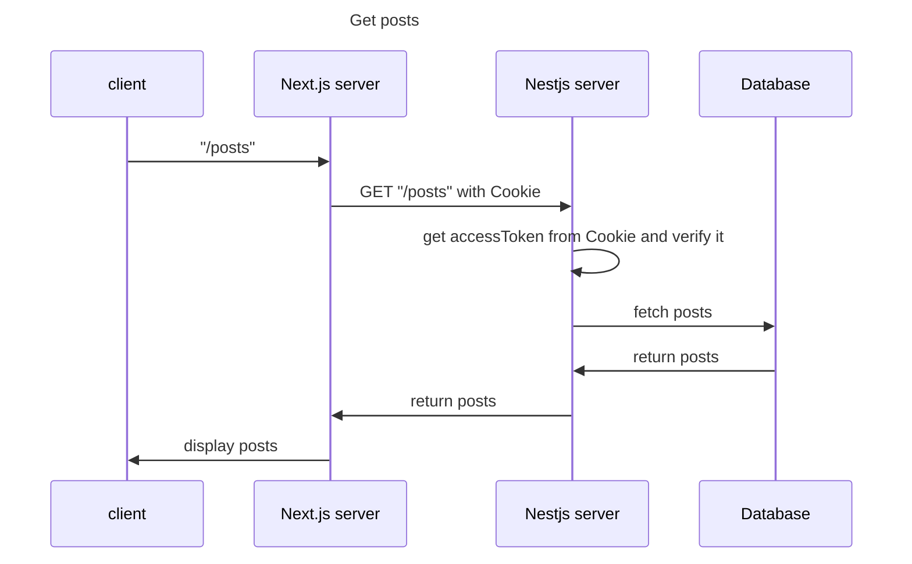

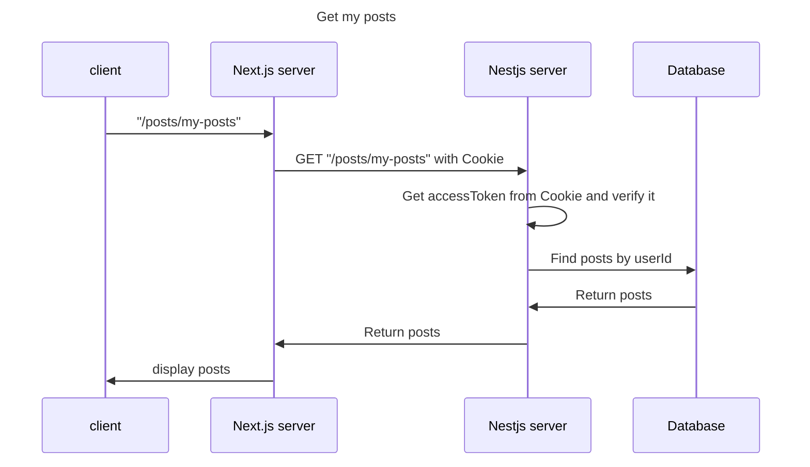

### ai-posts

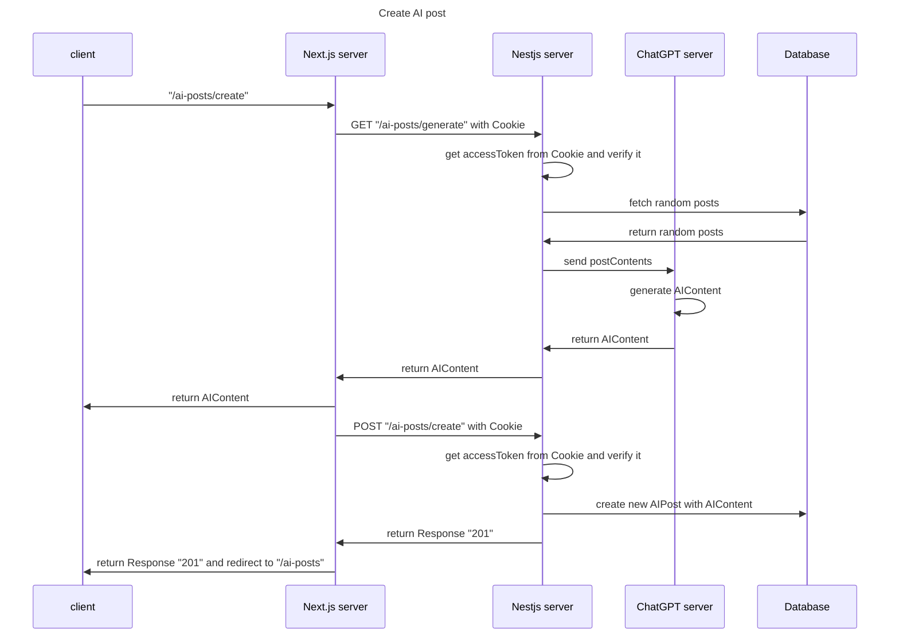

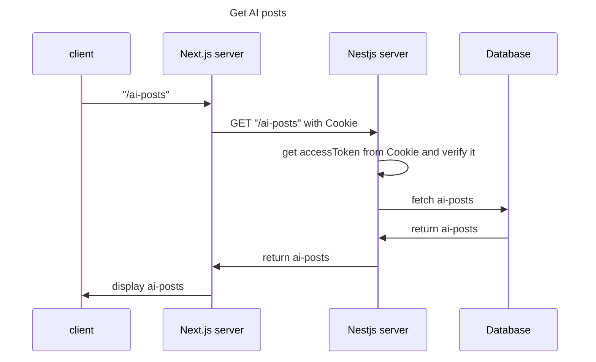

### user

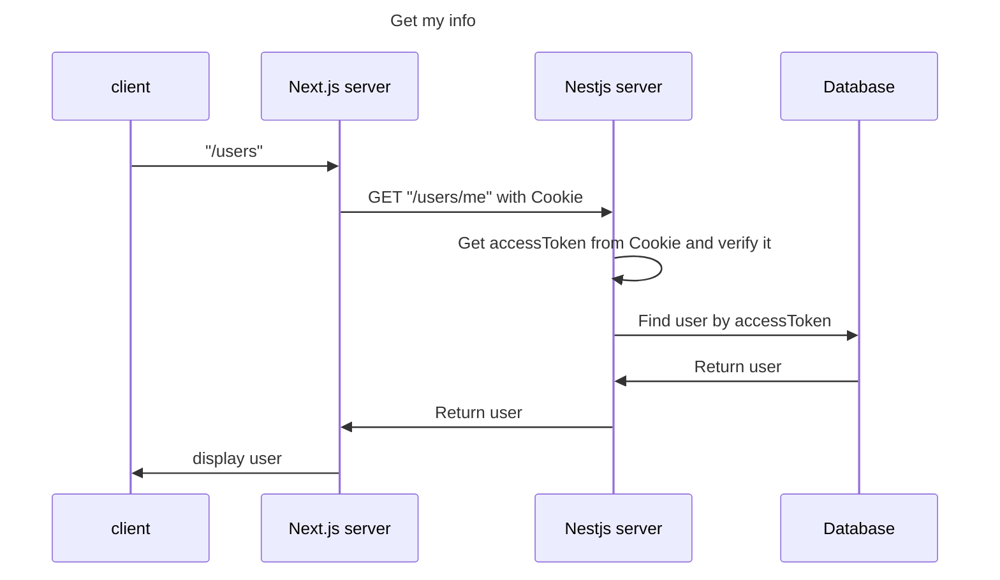

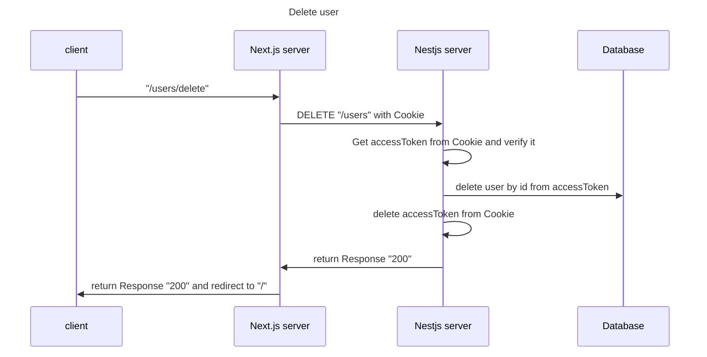
